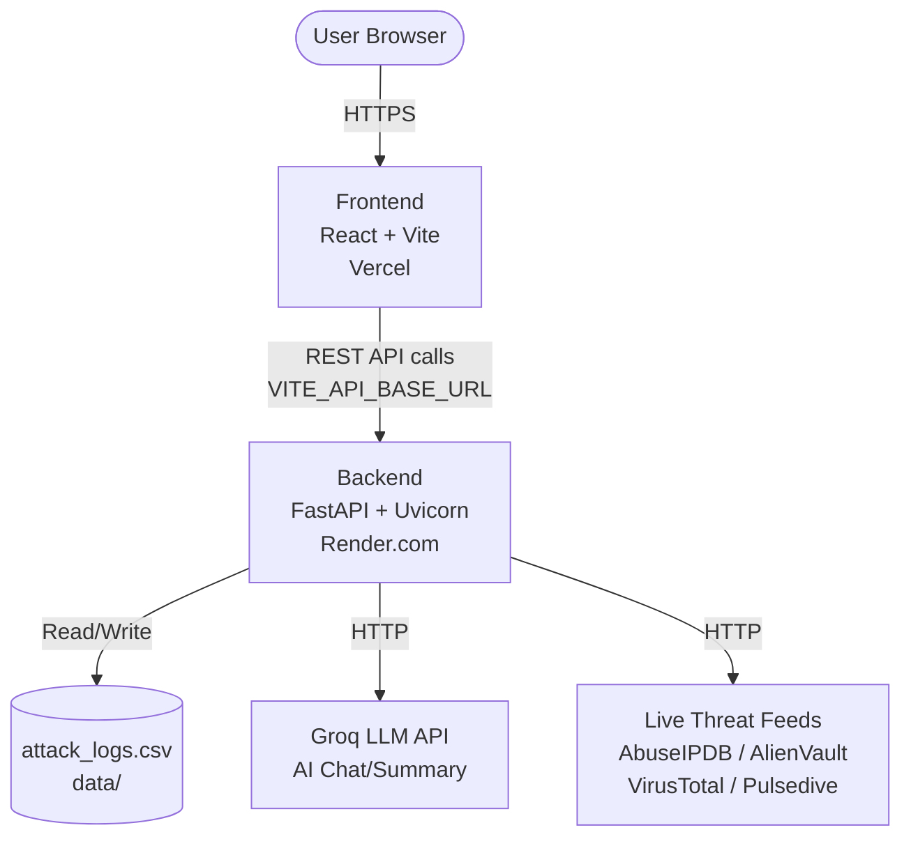
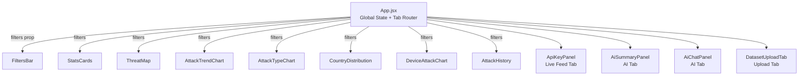

# Architecture — Cyber Threat Intelligence Visualization Dashboard

## Overview

A full-stack web application for visualizing and analyzing cyber threat data. The frontend is a React SPA; the backend is a Python FastAPI server. The two communicate over HTTP REST, and both can be deployed independently in the cloud.

---

## System Architecture



---

## Repository Structure

```
CyberThreat/
├── backend/                    # Python FastAPI server
│   ├── main.py                 # Entry point, all API route definitions
│   ├── requirements.txt        # Python dependencies
│   ├── .env                    # API keys (not committed)
│   └── services/
│       ├── data_generator.py   # Synthetic attack event generator
│       ├── analytics.py        # Data analysis & filtering logic
│       ├── live_feed.py        # Live threat intel provider integrations
│       └── ai_agent.py         # Groq LLM integration (chat + summary)
│
├── frontend/                   # React + Vite SPA
│   ├── index.html
│   ├── vite.config.js          # Dev proxy → localhost:8000
│   ├── package.json
│   └── src/
│       ├── main.jsx            # App entry point
│       ├── App.jsx             # Root component, tab routing, global state
│       ├── api/
│       │   └── api.js          # Axios API client (reads VITE_API_BASE_URL)
│       └── components/
│           ├── Sidebar.jsx           # Navigation sidebar
│           ├── FiltersBar.jsx        # Global dashboard filters
│           ├── StatsCards.jsx        # KPI summary cards
│           ├── ThreatMap.jsx         # World map with attack arcs
│           ├── AttackTrendChart.jsx  # Time-series trend chart
│           ├── AttackTypeChart.jsx   # Attack type distribution
│           ├── CountryDistribution.jsx # Source/target country bar chart
│           ├── DeviceAttackChart.jsx # Device type breakdown
│           ├── AttackHistory.jsx     # Scrollable event log table
│           ├── ApiKeyPanel.jsx       # Live feed API key entry UI
│           ├── AiSummaryPanel.jsx    # AI threat summary display
│           ├── AiChatPanel.jsx       # AI multi-turn chat interface
│           └── DatasetUploadTab.jsx  # CSV/Excel/JSON upload & analysis
│
├── data/
│   └── attack_logs.csv         # Persisted synthetic/uploaded threat data
│
└── ARCHITECTURE.md             # This file
```

---

## Backend API Reference

| Method | Endpoint | Description |
|--------|----------|-------------|
| `GET` | `/` | Health check |
| `GET` | `/api/threats` | Paginated threat events (filterable) |
| `GET` | `/api/stats` | KPI stats (totals, critical count, etc.) |
| `GET` | `/api/trends` | Daily time-series attack counts |
| `GET` | `/api/types` | Attack type frequency |
| `GET` | `/api/devices` | Device type frequency |
| `GET` | `/api/countries` | Source + target country distributions |
| `GET` | `/api/severity` | Severity distribution |
| `GET` | `/api/meta` | Filter options (countries, attack types, etc.) |
| `POST` | `/api/simulate` | Generate synthetic threat data |
| `POST` | `/api/upload` | Upload CSV/Excel/JSON dataset |
| `GET` | `/api/live/providers` | List supported live feed providers |
| `POST` | `/api/live/validate` | Validate a live feed API key |
| `POST` | `/api/live/fetch` | Fetch real threats from live provider |
| `GET` | `/api/ai/status` | Check if Groq key is configured |
| `POST` | `/api/ai/summary` | Generate AI executive summary |
| `POST` | `/api/ai/chat` | Multi-turn AI chat with threat context |

### Common Query Filters (GET endpoints)
All major GET endpoints support these optional query params:
- `country` — filter by source/target country
- `severity` — `Critical` / `High` / `Medium` / `Low`
- `attack_type` — e.g. `DDoS`, `Ransomware`
- `days` — last N days (7, 14, 30, 60, 90)

---

## Frontend Data Flow



All chart components call the shared `api.js` client independently using the current global filters passed down from `App.jsx`.

---

## Key Technologies

| Layer | Technology |
|-------|-----------|
| Frontend framework | React 18 + Vite 5 |
| Styling | Tailwind CSS |
| Charts | Recharts, Plotly.js |
| World map | react-simple-maps + d3-geo |
| HTTP client | Axios |
| Backend framework | FastAPI |
| ASGI server | Uvicorn |
| Data processing | Pandas, NumPy |
| Anomaly detection | scikit-learn (IsolationForest) |
| AI integration | Groq API (llama-3.1-8b-instant) |
| Live threat feeds | AbuseIPDB, AlienVault OTX, VirusTotal, Pulsedive, isMalicious |
| File parse support | openpyxl (Excel), built-in CSV, JSON |

---

## Environment Variables

### Backend (`backend/.env`)
| Variable | Purpose |
|----------|---------|
| `GROQ_API_KEY` | Enables AI chat and summary features |
| `GEMINI_API_KEY` | Reserved for future Gemini AI integration |

### Frontend (Vercel / `.env.local`)
| Variable | Purpose |
|----------|---------|
| `VITE_API_BASE_URL` | Backend URL in production (e.g. `https://your-app.onrender.com`) |

---

## Deployment Architecture

```
[GitHub Repository]
        │
        ├──► Vercel (Frontend)
        │      • Auto-deploy on git push
        │      • Builds: vite build
        │      • Env: VITE_API_BASE_URL → Render URL
        │
        └──► Render (Backend)
               • Auto-deploy on git push
               • Build: pip install -r requirements.txt
               • Start: uvicorn main:app --host 0.0.0.0 --port 10000
               • Env: GROQ_API_KEY, GEMINI_API_KEY
```

---

## Data Pipeline

```
Simulate (/api/simulate)
    └── data_generator.py → attack_logs.csv

Upload (/api/upload)
    └── Parses CSV/Excel/JSON → normalises columns → returns events (in-memory)

Dashboard Charts
    └── analytics.py reads attack_logs.csv → filters → aggregates → JSON response

Live Feed (/api/live/fetch)
    └── live_feed.py → queries external IP threat API → normalises → returns events (in-memory)
```
